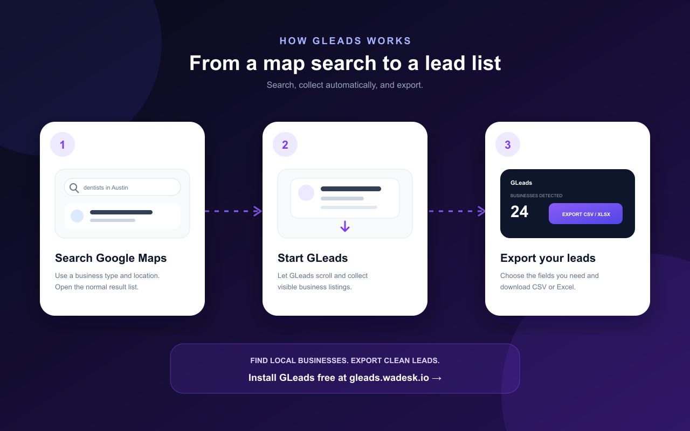

# GLeads — Google Maps Scraper & Leads Extractor

Turn Google Maps searches into structured business lead lists.

[简体中文](./README.zh-CN.md)

## Google Maps lead generation without manual copy and paste

GLeads is a browser extension that collects public business information loaded in Google Maps search results. Search for a business category and location, start GLeads, and export the deduplicated results as CSV or Excel.

No Google Maps API key is required.

## Features

- Automatically scroll through the current Google Maps result list
- Start, pause, resume, and reset collection
- Remove duplicate businesses using Google Place IDs
- Choose from more than 20 export fields
- Export results as CSV or XLSX
- Optionally download once the result list reaches the end
- Process collected listing data locally in the browser
- Use the interface in English or Simplified Chinese

## Product preview

## How to use GLeads

1. **[Install GLeads for Chrome](https://gleads.wadesk.io/google-maps-scraper-chrome-extension?utm_source=github&utm_medium=referral&utm_campaign=google-maps-scraper&utm_content=how-to-use)**.
2. Open [Google Maps](https://www.google.com/maps) and search for a business type plus a location, such as `dentists in Austin`.
3. Open the GLeads panel and start collection.
4. Let GLeads load the result list automatically. Pause or resume whenever needed.
5. Choose the fields you need and export the deduplicated records as CSV or Excel.

## Business fields

Available values depend on the information each business publicly provides in Google Maps.

- Business name and categories
- Full address, street, and city
- Primary and additional phone numbers
- Website and domain
- Average rating and review count
- Review URL and Google Maps URL
- Latitude and longitude
- Opening hours
- Claim status and featured image
- Place ID, CID, Plus Code, and KGMID
- Google Knowledge Graph URL

## Download

- **Chrome:** [installation page and guide](https://gleads.wadesk.io/google-maps-scraper-chrome-extension?utm_source=github&utm_medium=referral&utm_campaign=google-maps-scraper&utm_content=download)
- **Microsoft Edge:** [get GLeads from Microsoft Edge Add-ons](https://microsoftedge.microsoft.com/addons/detail/g-maps-extractor-g-map-/ahjileamoifdngmdkfgdhafjgcdnjkgg?hl=en-US)
- **Website:** [gleads.wadesk.io](https://gleads.wadesk.io/?utm_source=github&utm_medium=referral&utm_campaign=google-maps-scraper&utm_content=links)

GLeads is currently free. There is no subscription, credit card requirement, or Google Maps API key requirement.

## Privacy and responsible use

GLeads processes collected listing information inside the browser. Availability and accuracy depend on the data shown by Google Maps. Review important details before using them and comply with applicable platform terms, privacy laws, outreach rules, and opt-out requests.

## About this repository

This public repository is the official product introduction and documentation page for GLeads. It does **not** contain the browser extension source code or a self-hosted build.

GLeads is not affiliated with, endorsed by, or sponsored by Google. Google Maps is a trademark of Google LLC.
